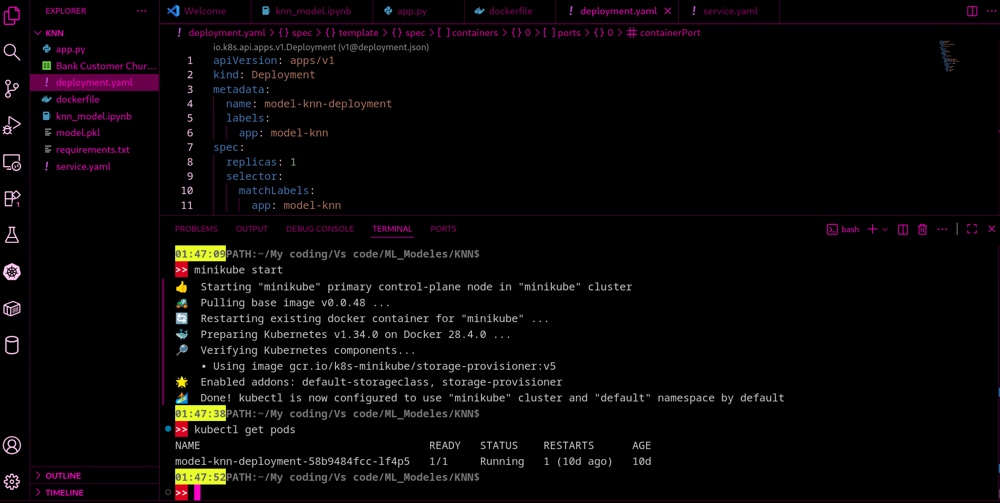
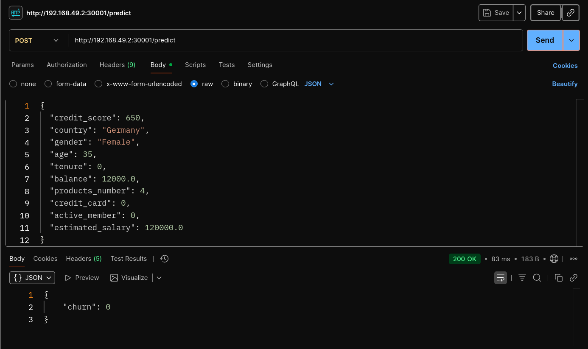

# Mini-Projet Machine Learning : Churn Prediction

Ce projet a pour objectif de prédire si un client va quitter une banque (**churn**) ou non en utilisant un modèle **KNN**.  
Le projet inclut également une API Flask, un container Docker et un déploiement Kubernetes via Minikube.

---

## Aperçu dans VSCode
  
Capture d’écran de l’interface VSCode avec le projet ouvert.

---

## Test de l’API dans Postman
  
Test de l’API KNN via Postman.

---

## Structure du projet

- **app.py** : API Flask exposant le modèle KNN.  
- **model.pkl** : Modèle KNN entraîné.  
- **requirements.txt** : Dépendances Python.  
- **Dockerfile** : Pour construire l’image Docker du projet.  
- **deployment.yaml** et **service.yaml** : Déploiement Kubernetes / Minikube.  
- **Images** : Aperçus de l’interface de VScode et des tests.

---

## Technologies utilisées

- **Python** (Flask, scikit-learn…)  
- **Docker** pour containeriser l’application  
- **Kubernetes / Minikube** pour le déploiement local  
- **Postman** pour tester l’API

---

## Instructions pour exécuter le projet
### Commandes pour exécuter le projet
```bash
# 1. Lancer l’API Flask localement
python app.py
# L'API sera disponible sur : http://127.0.0.1:5000/predict

# 2. Construire l'image Docker
docker build -t model_knn_img .

# 3. Lancer le container Docker
docker run -d -p 5000:5000 --name model_knn_container model_knn_img

# 4. Vérifier que le container tourne
docker ps

# 5. Démarrer Minikube
minikube start --driver=docker

# 6. Charger l'image Docker dans Minikube
minikube image load model_knn_img

# 7. Déployer l'application sur Kubernetes
kubectl apply -f deployment.yaml
kubectl apply -f service.yaml

# 8. Vérifier les pods
kubectl get pods

# 9. Obtenir l'URL du service pour accéder à l'API
minikube service model-knn-service --url
